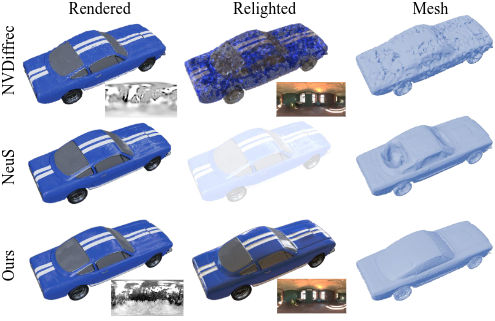

# NeuS-PIR: Learning Relightable Neural Surface using Pre-Integrated Rendering

[arXiv](https://arxiv.org/abs/2306.07632)

This repository contains an efficient method for jointly learning geometry, material properties, and illumination from multi-view image observations. This inverse rendering pipeline incorporates **Pre-Integrated Rendering** and **Neural Surface Representation** to learn *high-quality geometry* with *all-frequency illumination*. **Indirect illumination fields** can be distilled from the learned representations, further recovering the complex illumination effect like inter-reflection.




## Requirements
### Environment 
Here is am example to build the environment using conda.
``` sh
conda create -n neuspir python=3.9
conda activate neuspir
pip install torch==1.13.1+cu117 torchvision==0.14.1+cu117 torchaudio==0.13.1 --extra-index-url https://download.pytorch.org/whl/cu117
pip install -r requirements.txt
```
**Notice**: Originally there will be channel assertion in [nerfacc](https://www.nerfacc.com/). But in this implementation, we extend the channel for enconding materal features. An error like this might be reported during the first run. Simply comment the correspondin lines:
``` sh
File "your/path/to/conda/env/lib/python3.9/site-packages/nerfacc/vol_rendering.py", line 116, in rendering
    assert rgbs.shape[-1] == 3, "rgbs must have 3 channels, got {}".format(
AssertionError: rgbs must have 3 channels, got torch.Size([47503, 6])
```

### Data
 - **NeRFactor**: Download the rendered synthetic images from [NeRFactor-Dataset](https://drive.google.com/drive/folders/1-9HhqWwJhTBjUZqttLafKo72fNl4sB5E).
 - **shiny-relight**: We provide our generated shiny-relight scenes on [Google Drive](https://drive.google.com/drive/folders/1n9gLglWTdF93y8bv-hZq7Af5ozMXqLN7?usp=drive_link).

 The file structure should be like:
 ``` 
  DATA/
  ├── NeRFactor
  │   ├── light-probes/
  │   └── rendered-images/
  │       ├── lego-3072/
  │       └──......
  ├── shiny-relight
      ├── light-probes/
      └── synthesis-images/
           ├── car_mossy_forest_1k/
           └── toaster_garden_nook_1k/
 ```

## Run
### Training on NeuS-PIR

``` sh
# train on nerfactor dataset
python launch.py --config configs/neusPIR-nerfactor.yaml  --train --gpu 0 dataset.scene=lego_3072 tag=lego
# train on shiny dataset
python launch.py --config configs/neusPIR-shiny.yaml  --train --gpu 0 dataset.scene=car_mossy_forest_1k tag=shiny-car

```

### Distill indirect illumination from trained representations
``` sh
# example to distill indirect illumination for shiny-relight dataset
python launch.py --config configs/neusPIRindirect-shiny.yaml --train --gpu 0
```


## Related Projects
- [instant-nsr-pl](https://github.com/bennyguo/instant-nsr-pl): Great boilerplate for highly efficient NeRF or NeuS. Our work is based on this boilerplate.
- [NVDiffrec](https://github.com/NVlabs/nvdiffrec): implement efficient split-sum rendering based on the mipmapping implemented in [NVDiffrast](https://github.com/NVlabs/nvdiffrast). Out work adopts the similar approach and adapt it for NeuS rendering.

## Citation and acknowledgements
If NeuS-PIR is relevant to your project, please cite our associated [paper](https://arxiv.org/abs/2306.07632):
```
@article{mao2023neus,
  title={NeuS-PIR: Learning Relightable Neural Surface using Pre-Integrated Rendering},
  author={Mao, Shi and Wu, Chenming and Shen, Zhelun and Zhang, Liangjun},
  journal={arXiv preprint arXiv:2306.07632},
  year={2023}
}
```
